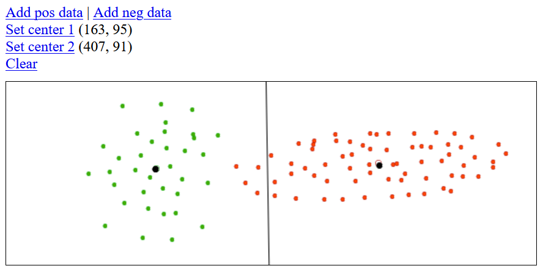

# <i>k</i>-means Study Buddy

This code snippet does only 2 things:

1. Lets you add points on the drawing area and shows the center of the points added.
   - Two groups of points can be added. One green ("Add pos data") and one red ("Add neg data")
      
2. Lets you draw two points ("Set center 1" and "Set center 2" respectively) on the canvas and shows a divider line according to the <I>k</I>-means algorithm. (The divider is an equidistance line from both points.)

This will help you better understand how <i>k</i>-means works and why its problem is not just with linear separability, but also with its equi-distance line method for classification.

This application is entirely in HTML5 and works on anywhere with a browser.
